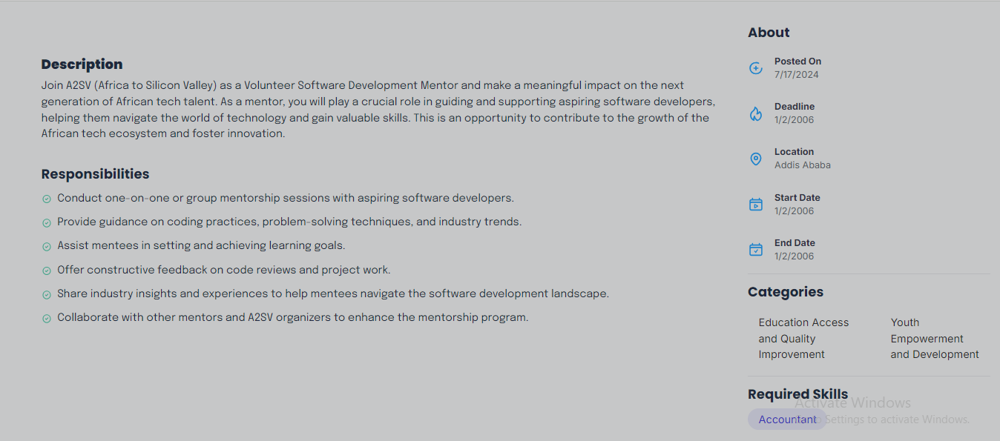

# Task 7: Integrating API Data into the Application

The goal of this task is to integrate data from a provided API endpoint into your application and populate the cards with the fetched data. This will involve fetching the data from the API, handling the data correctly, and ensuring the application displays the fetched data properly in the user interface.


# Getting Started

Clone the repository:


```git clone https://github.com/Metilamessa/Job-Listing-App.git```

Install dependencies:


```cd job-listing-app```

````npm install```

Start the development server:

```npm run dev```

# Screenshots



